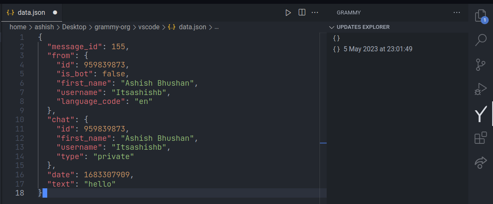
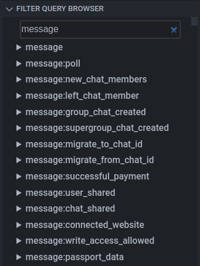

# grammY VS Code

Enhance your experience when developing with grammY.

- [grammY VS Code](#grammy-vs-code)
  - [Features](#features)
    - [Snippets](#snippets)
    - [Updates Explorer](#updates-explorer)
    - [Filter Explorer](#filter-explorer)
  - [Contributing](#contributing)
  - [Development](#development)

## Features

### Snippets

The extension features some of the most used code snippets for the grammy
library to save users time and effort in developing telegram bots.

### Updates Explorer

We all need to go and check for the full update json tree sometimes, right!!!
`Typescript` users have types but still we sometimes need to have a look on what
we are working with.

The extension features `a real-time` updates explorer in the sidebar and it will
show all the updates that your bot will receive.

<div align="center">
    
</div>

### Filter Explorer

One of the many cool features of `grammy` is it's
[Filter Queries](https://grammy.dev/guide/filter-queries.html) and there are
lots of them (like 800+ of em) and you may want to know a bit more about what
exactly do they filter and how to access them.

And the the explorer does exactly that you get a complete list of all the
`Filter Queries` with their description right in your editor.

<div align="center">
    
</div>

## Contributing

You’re welcome to contribute by reporting issues and making pull requests of any
size. Don’t forget that we’re following
[Conventional Commits](https://www.conventionalcommits.org/en/v1.0.0/).

## Development

1. Clone the repository and open it with VS Code.

```sh
git clone https://github.com/grammyjs/vscode.git
```

2. Install the dependencies.

```sh
yarn install
```

3. Press `F5` or the whatever key you have configured to start the development
   tasks.
